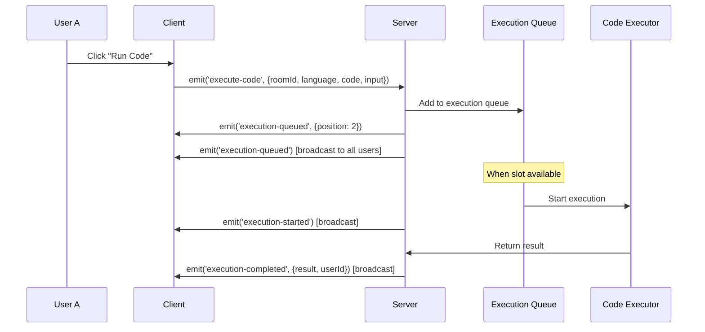

# Concurrent Code Execution Guide

This guide explains how to handle concurrent code executions from multiple users in the same collaborative session, ensuring proper user association, output management, and execution queuing.

## Overview

When multiple users are collaborating in the same session, they may want to execute code simultaneously. The concurrent execution system provides:

- **Execution Queuing**: Prevents resource conflicts by queuing executions
- **User Association**: Associates each execution with the correct user
- **Real-time Status**: Shows execution status to all users in real-time
- **Output Management**: Displays outputs with proper user attribution
- **Resource Management**: Limits concurrent executions to prevent system overload

## Architecture

### Backend Components

#### 1. ConcurrentExecutionManager (`server/utils/concurrentExecutionManager.js`)

The core manager that handles all concurrent execution logic:

```javascript
class ConcurrentExecutionManager {
  constructor() {
    this.executionQueues = new Map(); // roomId -> Queue
    this.activeExecutions = new Map(); // roomId -> Set of executionIds
    this.executionResults = new Map(); // executionId -> ExecutionResult
    this.userExecutions = new Map(); // userId -> Set of executionIds
  }
}
```

**Key Features:**
- **Queue Management**: Maintains execution queues per room
- **Concurrency Control**: Limits concurrent executions (default: 3 per room)
- **User Tracking**: Prevents users from having multiple active executions
- **Timeout Handling**: Automatically times out long-running executions
- **Cleanup**: Removes old execution results to prevent memory leaks

#### 2. Socket Handler Integration (`server/utils/socketHandler.js`)

Enhanced socket handler that integrates with the concurrent execution manager:

```javascript
// Handle code execution requests with concurrent execution management
socket.on('execute-code', async (data) => {
  const result = await concurrentExecutionManager.requestExecution(
    roomId,
    socket.user._id.toString(),
    socket.user.displayName,
    socket.user.avatar,
    language,
    code,
    input,
    socket,
    io
  );
});
```

**New Socket Events:**
- `get-execution-status`: Request current execution status
- `get-execution-history`: Request execution history
- `cancel-execution`: Cancel user's queued execution

### Frontend Components

#### 1. ConcurrentExecutionHandler (`client/src/components/ConcurrentExecutionHandler.tsx`)

React component that provides a user interface for managing concurrent executions:

```typescript
interface ExecutionStatus {
  queued: Array<{
    userId: string;
    displayName: string;
    avatar?: string;
    timestamp: Date;
  }>;
  active: Array<{
    userId: string;
    displayName: string;
    avatar?: string;
    startTime: Date;
  }>;
  queueLength: number;
  activeCount: number;
  maxConcurrent: number;
}
```

**Features:**
- **Status Indicator**: Shows current execution status in the top-right corner
- **Execution Panel**: Detailed view of active and queued executions
- **User Attribution**: Clearly shows which user is executing code
- **Cancel Functionality**: Allows users to cancel their queued executions
- **Real-time Updates**: Automatically refreshes status every 2 seconds

#### 2. Enhanced CollaborativeEditor

Updated to integrate with the concurrent execution system:

```typescript
// Add ConcurrentExecutionHandler to the editor
<ConcurrentExecutionHandler
  socket={socketRef.current}
  roomId={currentSessionId}
  currentUserId={currentUser?.uid || ''}
  onExecutionStatusChange={(status) => {
    console.log('Execution status changed:', status);
  }}
  onExecutionHistoryUpdate={(history) => {
    console.log('Execution history updated:', history);
  }}
/>
```

## How It Works

### 1. Execution Request Flow



### 2. User Association

Each execution is associated with:
- **User ID**: Unique identifier for the user
- **Display Name**: Human-readable name
- **Avatar**: User's profile picture
- **Execution ID**: Unique execution identifier
- **Timestamp**: When the execution was requested

### 3. Queue Management

The system maintains separate queues for each room:

```javascript
// Example queue state
{
  "room_123": [
    {
      id: "exec_1234567890_abc123",
      userId: "user_1",
      displayName: "Alice",
      language: "javascript",
      code: "console.log('Hello')",
      status: "queued",
      timestamp: "2024-01-01T10:00:00Z"
    },
    {
      id: "exec_1234567891_def456",
      userId: "user_2", 
      displayName: "Bob",
      language: "python",
      code: "print('Hello')",
      status: "queued",
      timestamp: "2024-01-01T10:01:00Z"
    }
  ]
}
```

### 4. Concurrency Limits

Default configuration:
- **Max Concurrent Executions**: 3 per room
- **Max Queue Size**: 10 executions per room
- **Execution Timeout**: 30 seconds
- **Cleanup Interval**: 60 seconds

## Implementation Details

### Backend Configuration

```javascript
// In concurrentExecutionManager.js
this.config = {
  maxConcurrentExecutions: 3, // Max concurrent executions per room
  maxQueueSize: 10, // Max queued executions per room
  executionTimeout: 30000, // 30 seconds
  cleanupInterval: 60000 // Cleanup every minute
};
```

### Frontend Integration

```typescript
// In CollaborativeEditor.tsx
const handleRunCode = useCallback(async () => {
  if (!code.trim()) return;

  setOutputLoading(true);
  setShowTerminal(true);
  setIsExecuting(true);

  try {
    // Use socket to request execution through concurrent manager
    if (socketRef.current && connectionStatus === 'connected') {
      socketRef.current.emit('execute-code', {
        roomId: currentSessionId,
        language,
        code,
        input: customInput
      });
    }
  } catch (error) {
    console.error('Code execution error:', error);
    setOutputLoading(false);
    setIsExecuting(false);
  }
}, [code, language, customInput, connectionStatus, currentSessionId]);
```

### Socket Event Handling

```typescript
// Handle new execution events
socket.on('execution-queued', (data) => {
  if (data.userId !== currentUser?.uid) {
    showInfo('Code Execution', `${data.displayName} queued code execution (position ${data.position})`);
  }
});

socket.on('execution-started', (data) => {
  if (data.userId !== currentUser?.uid) {
    setIsExecuting(true);
    showInfo('Code Execution', `${data.displayName} started executing ${data.language} code`);
  }
});

socket.on('execution-completed', (data) => {
  setIsExecuting(false);
  if (data.userId !== currentUser?.uid) {
    setTerminalOutput({
      stdout: data.result.stdout || '',
      stderr: data.result.stderr || '',
      status: data.result.status || 'success',
      executionTime: data.executionTime
    });
    setShowTerminal(true);
    showSuccess('Code Executed', `${data.displayName} completed execution in ${(data.executionTime / 1000).toFixed(2)}s`);
  }
});
```

## User Experience

### 1. Execution Status Indicator

Users see a status indicator in the top-right corner:
- **Ready**: No executions in progress
- **1 executing**: Shows active execution count
- **2 queued**: Shows queued execution count
- **Badge**: Total number of active + queued executions

### 2. Execution Panel

Clicking the status indicator opens a detailed panel showing:

**Currently Executing:**
- User avatars and names
- Execution start time
- Language being executed
- Real-time status with pulsing indicator

**Queued Executions:**
- Position in queue
- User information
- Queue timestamp
- Cancel button (for user's own executions)

**Recent History:**
- Last 5 executions
- Success/failure status
- Execution time
- User attribution

### 3. Real-time Notifications

Users receive notifications for:
- When someone queues an execution
- When execution starts
- When execution completes (with timing)
- When execution fails (with error details)

## Security Considerations

### 1. User Validation
- All execution requests require authentication
- Users can only cancel their own queued executions
- Active executions cannot be cancelled for security

### 2. Resource Limits
- Maximum 3 concurrent executions per room
- 30-second execution timeout
- 10KB code size limit
- Memory and CPU limits in Docker containers

### 3. Input Validation
- Language validation against allowed list
- Code content validation for dangerous patterns
- Input sanitization

## Performance Optimization

### 1. Memory Management
- Automatic cleanup of old execution results (24 hours)
- Limited execution history storage
- Efficient queue management

### 2. Real-time Updates
- WebSocket-based real-time communication
- Efficient event broadcasting
- Minimal data transfer

### 3. Scalability
- Per-room execution isolation
- Configurable concurrency limits
- Horizontal scaling support

## Troubleshooting

### Common Issues

1. **Execution Stuck in Queue**
   - Check if user already has an active execution
   - Verify queue size limits
   - Check server logs for errors

2. **Execution Timeout**
   - Increase timeout in configuration
   - Check for infinite loops in code
   - Verify resource limits

3. **User Association Issues**
   - Verify user authentication
   - Check socket connection status
   - Ensure proper user ID mapping

### Debugging

Enable debug logging:

```javascript
// In concurrentExecutionManager.js
console.log('Execution queued:', executionRequest);
console.log('Execution started:', executionId);
console.log('Execution completed:', result);
```

### Monitoring

Monitor execution statistics:

```javascript
const stats = concurrentExecutionManager.getStatistics();
console.log('Execution stats:', stats);
// Output: { totalExecutions: 150, activeExecutions: 2, completedExecutions: 145, failedExecutions: 3, successRate: 96.67 }
```

## Best Practices

### 1. User Communication
- Always show clear status messages
- Provide estimated wait times
- Allow users to cancel queued executions

### 2. Resource Management
- Set appropriate concurrency limits
- Monitor system resources
- Implement proper cleanup

### 3. Error Handling
- Graceful degradation when services are unavailable
- Clear error messages to users
- Proper logging for debugging

### 4. Performance
- Use efficient data structures
- Implement proper caching
- Monitor and optimize bottlenecks

## Future Enhancements

### 1. Priority Queues
- Allow certain users (teachers, admins) to have priority
- Implement different queue tiers

### 2. Execution Scheduling
- Allow users to schedule executions
- Batch similar executions

### 3. Advanced Monitoring
- Real-time execution metrics
- Performance analytics
- Resource usage tracking

### 4. Enhanced UI
- Execution timeline visualization
- Code diff highlighting
- Collaborative debugging features

This concurrent execution system provides a robust foundation for handling multiple users executing code simultaneously while maintaining proper user association, resource management, and user experience.
